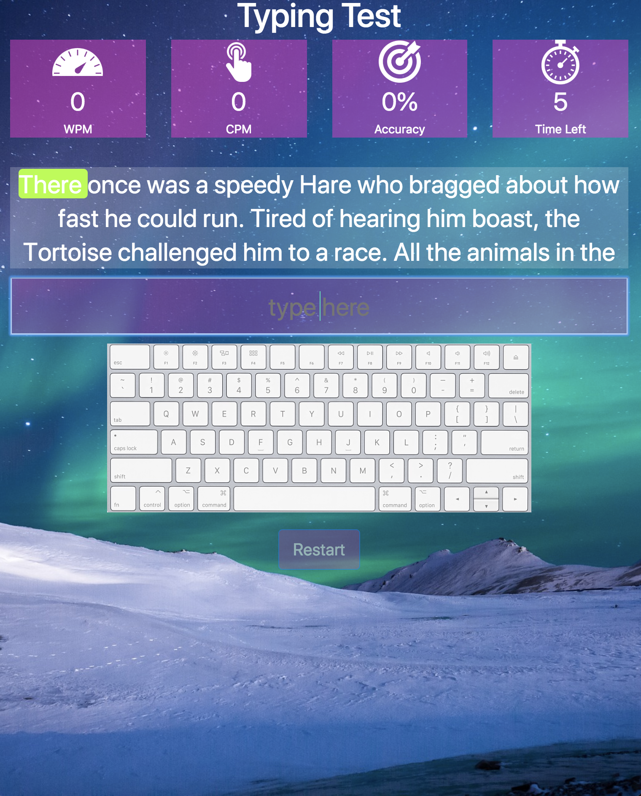
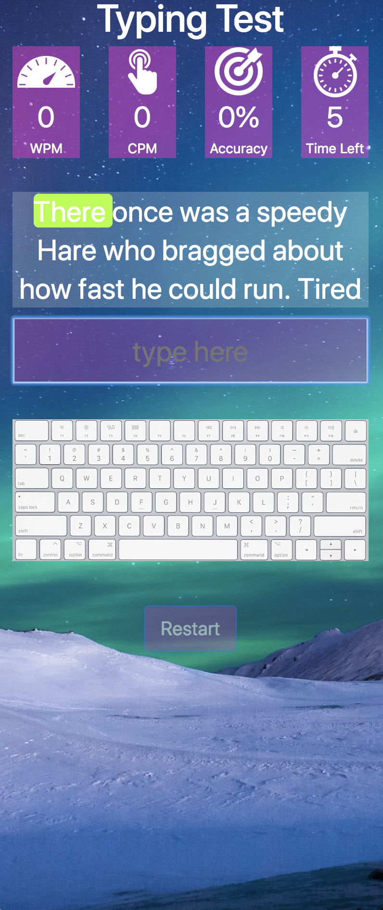
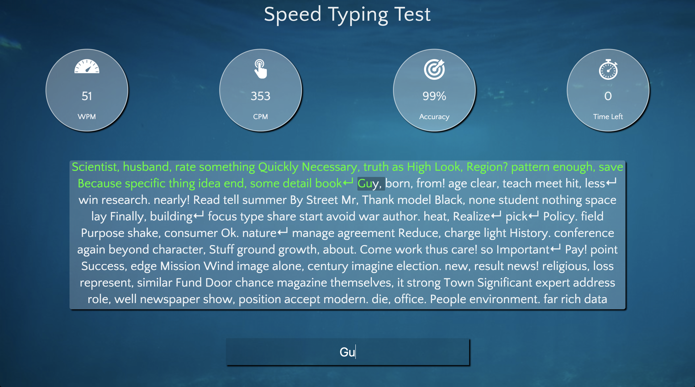
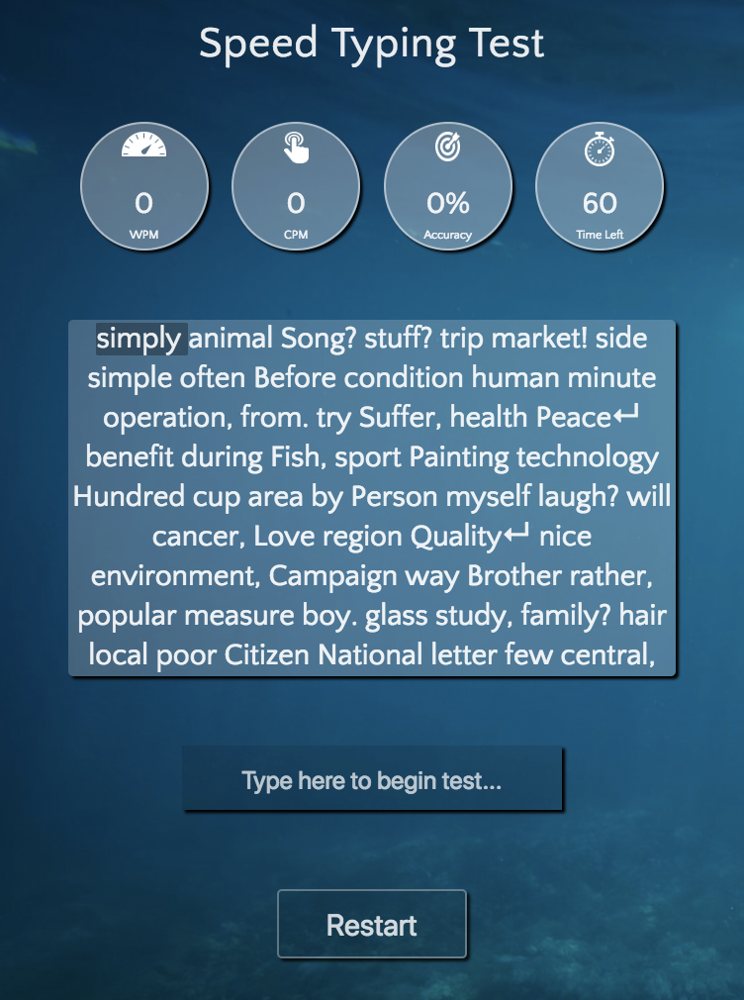
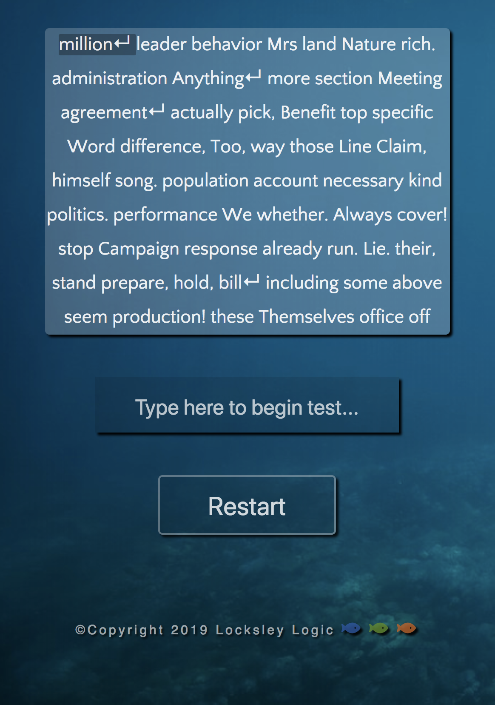
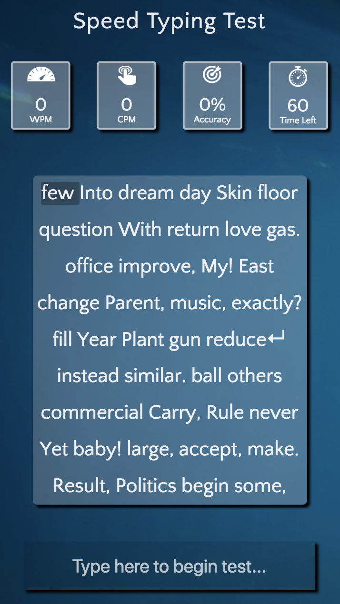
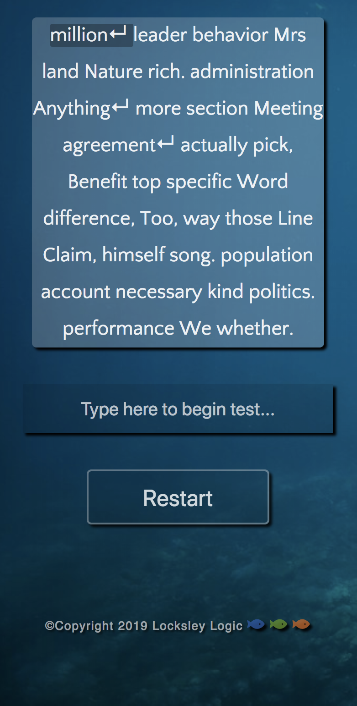

# Speed Typewriter JavaScript App Bootstrap to CSS Redesign

## What Is This Project About
This speed typewriter app is an online Udemy project I converted from Boostrap to CSS using Flexbox. Below are before and after images. The objective with building this project was to gain a deeper understanding of JavaScript closures, modular code design patterns, and to gain fluency translating code across different technologies.

## Technologies used before
* HTML
* CSS
* Bootstrap
* Vanilla JavaScript
* jQuery

## Technologies used after
* HTML
* CSS - Flexbox
* Vanilla JavaScript
* jQuery

## Speed Typing Test Before Images and Responsive Breakpoints - Bootstrap Layout

### Large breakpoint
<p align='center'>
    </img>
</p>

### Medium Breakpoint
<p align='center'>
</img>
</p>

### Small Breakpoint
<p align='center'>
    </img>
</p>

## Speed Typing Test After Images and Responsive Breakpoints CSS Flexbox Layout

### Large breakpoint
<p align='center'>
    </img>
</p>

<p align='center'>
</img>
</p>

### Medium Breakpoint
<p align='center'>
</img>
</p>

<p align='center'>
</img>
</p>

### Small Breakpoint
<p align='center'>
</img>
</p>
<p align='center'>
</img>
</p>

## Challenges and Coding Patterns Used In This Project


<p>I found these coding pattern to be very interesting conceptually and beyond useful. It took some practice to visualize what part each component played in this project but with practice, I quickly appreciated and became fond of these different patterns and their capabilities. This project incorporated techniques on DOM Manipulation, string manipulation, string randomization, closures, event listeners and much more. </p>

### IIFE, Closures, Public and Private Variables
<p>Accesses variables and methods after the surrounding function has been invoked by returning and object with invokable methods.</p>

```
var wordsModule = (function(){
    var words = ['hello'];

    return{
        getWords(textNumber){
            return words[textNumber];
        }
    }
})();

```

### DOM Manipulation
<p>Updates the inner HTML of wpm, cpm, and overall accuracy to be displayed to the user in the browser.</p>

```
 // Update the wpm
DOMElements.wpm.innerHTML = results.wpm;

// Update clicks per minute
DOMElements.cpm.innerHTML = results.cpm;

// Update accuracy
DOMElements.accuracy.innerHTML = results.accuracy + '%';
```

### String Manipulation
<p>Passes our map function, bite-size functions in a modular fashion to organize code. </p>

```
fillContent: function(array, lineReturn){
            var content = array.map(splitArray);
            content = content.map(addSpace);
            content = content.map(addSpanTags);
            content = content.map(addWordSpanTags);
            content = content.map(joinEachWord);
            content = content.join('');
            // This line of code wiill not work so the next line is a solution we can us to change all pipe characters into carrage returns
            // content = content.replace('<span>|</span>', '<span>&crarr;</span>');
            content = content.split('<span>' + lineReturn + '</span>').join('<span>&crarr;</span>')
            // console.log(content)

            DOMElements.content.innerHTML = content;
        }, 
```

### Event Listeners
<p>Checks to see if test is still in progress and what to do if the user has pressed enter. </p>

```
    // Enter click event
    uModule.getDOMElements().textInput.addEventListener('keydown', function(event) {
        console.log(event)
        // Check if test ended and if it has do nothing
        if (dModule.testEnded()) {
            return;
        }

        // Check if the user pressed enter
        var key = event.keyCode;
        if(key == 13) {
            uModule.getDOMElements().textInput.value += dModule.getLineReturn() + ' ';

            // Create a new input event
            var inputEvent = new Event('input');

            // Dispach it
            uModule.getDOMElements().textInput.dispatchEvent(inputEvent);
        }
    })
```
